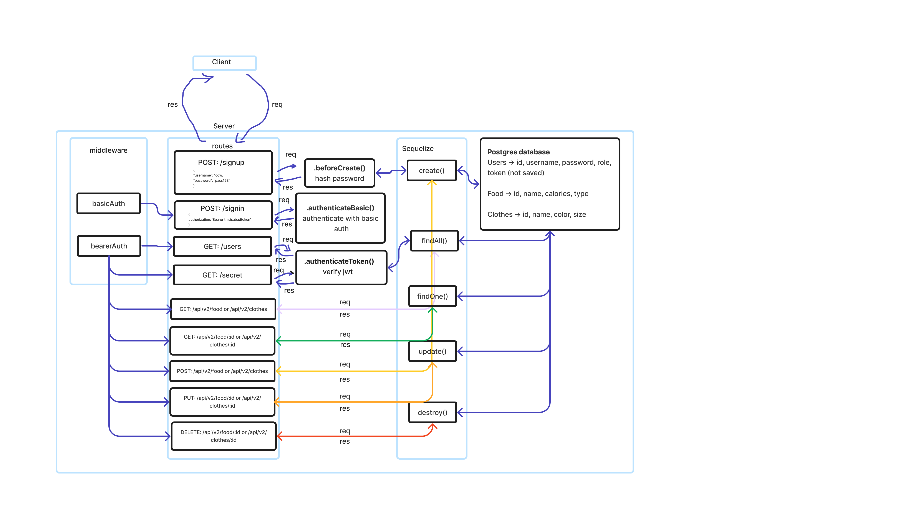

# LAB - Class 8

## Project: Auth API

### Author: Jelani R

### Problem Domain  

- Task 1: Combine these 2 servers into a single server
- Task 2: Create a new set of “Protected” API routes
- Task 3: Apply best practices and quality engineering

### Links and Resources

- [GitHub Actions ci/cd](https://github.com/Jchips/auth-api/actions)
- [back-end server url](https://auth-api-dev-4rc4.onrender.com)
- [Pull Request](https://github.com/Jchips/auth-api/pull/1)

### Setup

#### `.env` requirements

- PORT:enter-whatever-port-you-want
- DATABASE_URL=postgres-database-url
- SECRET=a-secret-for-jwt-tokens

#### How to initialize/run your application

- `nodemon` (if installed) OR
- `npm start`

#### Features / Routes

- What was your key takeaway?

    My key takeaway is how to implement access control into a rest api that uses basic and bearer auth.

- Pull request: <https://github.com/Jchips/auth-api/pull/1>

/api/v1 routes (works with /food or /clothes)

- GET : `/api/v1/food` - Fetches all the food
- GET : `/api/v1/food/:id` - Fetches specific food
- POST : `/api/v1/food` - Add food
- PUT : `/api/v1/food/:id` - Update specific food
- DELETE : `/api/v1/food/:id` - Delete specific food

/api/v2 routes (works with /food or /clothes)

- GET : `/api/v2/clothes` - Fetches all the clothes
- GET : `/api/v2/clothes/:id` - Fetches specific clothing item
- POST : `/api/v2/clothes` - Add clothes
- PUT : `/api/v2/clothes/:id` - Update specific clothing item
- DELETE : `/api/v2/clothes/:id` - Delete specific clothing item

Auth routes

- POST : `/signup` - Sign up a user
- POST : `/signin` - Sign in with a user that already signed up
- GET : `/users` - Displays all user names only for users with tokens
- GET : `/secret` - Displays a secret message only for users with tokens

#### Tests

- How do you run tests?
`npm test`
- Any tests of note?
  - Tests to make sure CRUD operations are performing right
  - Error handling tests
  - POST to /signup to create a new user
  - POST to /signin to login as a user (use basic auth)
  - Tests to make sure only authenticated users can access stuff on the /v2 routes

#### UML

